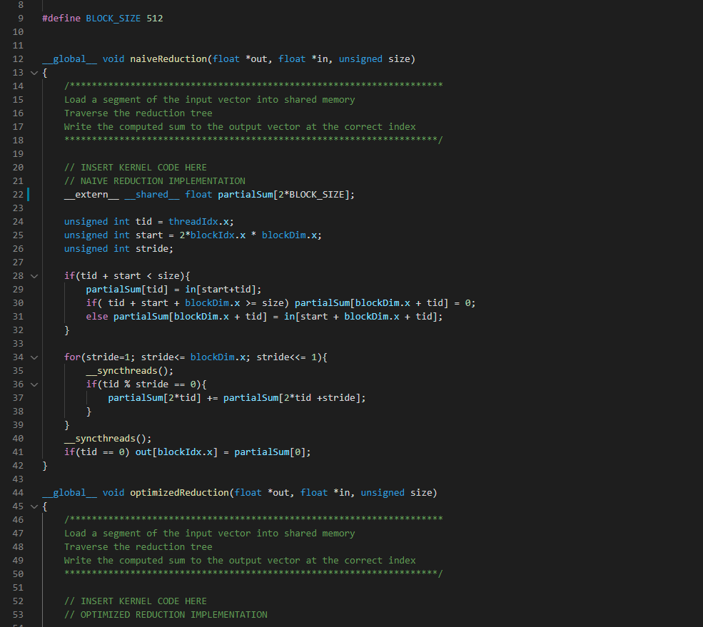

# vscuda README

VS Code extension for CUDA support. Includes syntax highlighting, code help and auto code completion.  

## Features

### Syntax Highlighting

> Highlights CUDA specific specifiers as well as C/C++ syntax

### Code Help

> Shows CUDA function parameters 

### Code Completion

> Shows popular CUDA functions for auto-complete along with function parameters in markdown

## Requirements

VS Code version ^1.62.0

## Release Notes

### 0.0.1

Beta release of VSCuda
